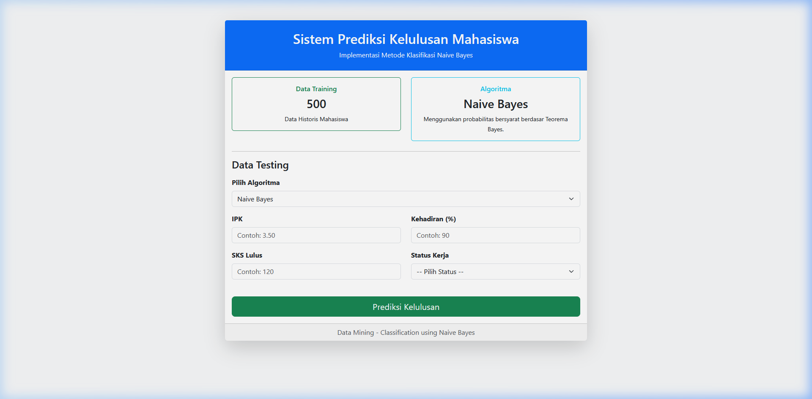

# Sistem Prediksi Kelulusan Mahasiswa



**Nama** : Wisnu Widya Pradana  
**NIM**  : 411231088  

---

## Deskripsi Tugas

Project ini merupakan pengembangan dari *codebase* klasifikasi yang telah diberikan sebelumnya. Fokus utamanya adalah menambahkan tiga algoritma *machine learning* baru ke dalam sistem prediksi kelulusan mahasiswa, sehingga sistem memiliki opsi pemrosesan algoritma yang lebih beragam.

### Apa Saja yang Ditambahkan?

1. **Penambahan Algoritma Klasifikasi (Pada Controller):**
   - **Naive Bayes (Base)**: Menggunakan algoritma probabilitas bawaan dari *codebase* asli.
   - **Decision Tree (Baru)**: Diterapkan menggunakan struktur pohon keputusan (*rule-based*) untuk memisahkan data berdasarkan atribut IPK, kehadiran, dan SKS.
   - **Random Forest (Baru)**: Diterapkan dengan metode *ensemble*, membangun 3 pohon keputusan terpisah lalu mengambil hasil akhir berdasarkan suara terbanyak (*majority voting*).
   - **Logistic Regression (Baru)**: Diterapkan dengan menyusun perhitungan bobot kombinasi linear (*linear combination*) dan disalurkan melalui fungsi aktivasi Sigmoid untuk mendapatkan probabilitas klasifikasi.

2. **Pembaruan Tampilan (UI):**
   - Menambahkan menu *dropdown* pada *form* input di halaman utama agar bisa leluasa memilih algoritma saat melakukan prediksi.
   - Menyesuaikan jendela *pop-up* hasil prediksi (SweetAlert) agar turut mencantumkan nama algoritma yang baru saja dieksekusi.

---

## Cara Setup dan Menjalankan Project

Project ini dibuat sepraktis mungkin dengan menggunakan **SQLite**. Seluruh data *training* (sebayak 500 baris data mahasiswa) sudah otomatis tertanam di dalam *file database* bawaan (`database/database.sqlite`). Oleh karena itu, **tidak perlu lagi menyalakan MySQL ataupun mengatur XAMPP**.

Berikut langkah-langkah untuk menjalankan aplikasinya:

1. Buka Terminal atau Command Prompt, lalu arahkan ke dalam folder *project* ini.
2. Jika *project* ini baru saja diunduh (*clone*), jalankan perintah berikut untuk memastikan semua paket Laravel ter-install:
   ```bash
   composer install
   cp .env.example .env
   php artisan key:generate
   ```
   *(Catatan: Langkah di atas bisa dilewati jika folder `vendor` dan file `.env` sudah tersedia).*
3. Nyalakan *server* lokal Laravel dengan perintah:
   ```bash
   php artisan serve
   ```
4. Buka *browser* dan akses tautan yang diberikan (umumnya `http://127.0.0.1:8000`).
5. Sistem Klasifikasi Kelulusan Mahasiswa siap digunakan untuk melakukan prediksi!

---

## Persyaratan Sistem (Requirements)

- **PHP**: Versi 8.2 atau lebih baru.
- **Composer**: Untuk manajemen paket (dependencies) Laravel.
- **Ekstensi PHP SQLite**: Pastikan ekstensi `pdo_sqlite` dan `sqlite3` aktif (biasanya sudah aktif secara *default* jika menggunakan instalasi XAMPP/Laragon terbaru).

---

## Troubleshooting (Solusi jika terjadi Error)

1. **Error: `No application encryption key has been specified.`**
   - **Penyebab**: File konfigurasi `.env` belum memiliki kode enkripsi `APP_KEY`.
   - **Solusi**: Jalankan perintah `php artisan key:generate` di Terminal/CMD.

2. **Error: `could not find driver` (Saat mengakses database)**
   - **Penyebab**: Ekstensi SQLite di pengaturan PHP komputermu belum dinyalakan.
   - **Solusi**: 
     - Buka file konfigurasi PHP (`php.ini`). Kalau pakai XAMPP, bisa klik tombol `Config` -> `PHP (php.ini)` di baris Apache.
     - Cari tulisan `;extension=pdo_sqlite` dan `;extension=sqlite3`.
     - Hapus tanda titik koma (`;`) di awal tulisan tersebut agar aktif.
     - Simpan (Save) lalu *restart* Terminal/CMD kamu.

3. **Error: `Database (database/database.sqlite) does not exist.`**
   - **Penyebab**: File database terhapus secara tidak sengaja.
   - **Solusi**: Buat file kosong baru bernama `database.sqlite` di dalam folder `database/`.

4. **Error: `Target class [App\Http\Controllers\ClassificationController] does not exist.`**
   - **Penyebab**: Composer gagal mendeteksi file *controller* yang baru.
   - **Solusi**: Jalankan perintah `composer dump-autoload` di Terminal/CMD.
